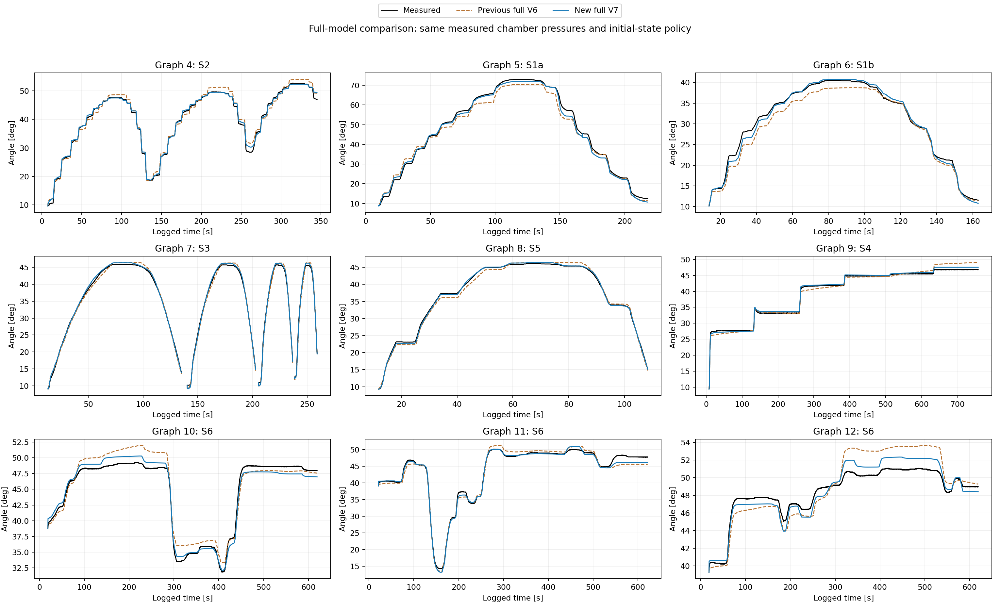

# 현재 보존 모델 V7 — 무엇이 달라졌나

현재 사용자가 승인한 결과는
[`adaptive_slots_v7/selected_model.json`](../reports/residual_actuator4_20261007/adaptive_slots_v7/selected_model.json)이다.
오프라인 액추에이터 4, 장착 2의 모델이며 실기 제어기에 적용한 변경은 아니다.

## 원래 공칭과 현재 전체 모델

공칭은 논문의 기하 기반 챔버 힘, 중력/탄성 퍼텐셜, tanh 마찰, 점성 항이다.
입력은 목표 압력이 아니라 측정한 두 챔버 압력이다.
현재 전체 모델은 이 공칭 구조의 허용된 위치에만 보정을 넣는다.

| 부분 | 기존 V6 | 현재 V7 | 의미 |
| --- | --- | --- | --- |
| 유효면적 보정 | 챔버별 계수, 고정 tanh 중심/폭 | 챔버별 중심/폭도 식별 | 각도에 따라 스텝 크기가 달라지는 반응을 표현 |
| 저장 에너지 | 압력 독립 스칼라 tanh 퍼텐셜 | 구조 유지, 계수 공동 재식별 | 탄성/복원력 보정 |
| 마찰·점성 | 비음수 계수 | 구조 유지, 계수 공동 재식별 | 정지와 운동의 차이 |
| 이력 상태 2개 | 길이 이력, 양의 이완 속도 | 측정 압력에 따른 양의 속도 배율 추가 | 압력 조건에 따라 크리프/기억이 풀리는 속도 변화 |
| 피팅 손실 | 각도 + 10초 운동 변화량 | 30/120초 저변동 구간 변화량 추가 | 미세 운동을 무시하는 해 억제 |

전체 방정식의 개요(`v=qdot`):

```
H = 0.5*J*v² + V_nom(q) + V_res(x2) + sum(0.5*k_j*(q-xi_j)²)
J*vdot = G_eff(q,P)*P - d(V_nom+V_res)/dq - friction - sum(k_j*(q-xi_j))
xi_dot_j = lambda_j(P,v)*(q-xi_j)
lambda_j = (1/tau_j + rho_j*k_j*abs(v)) * exp(w_j @ tanh(abs(P)/50000))
y = G_eff(q,P)^T * v
```

`k,tau,rho`는 양수, 마찰 소산은 비음수다. 에너지에는 압력을 넣지 않는다.
동일한 `G_eff`로 입력 토크와 출력 y를 정의하므로 전력 항등식을 유지한다.
따라서 `Hdot = P^T*y - friction*v - sum(k_j*lambda_j*(q-xi_j)^2) <= P^T*y`.
외부 토크가 있으면 그 공급 전력을 별도로 더해야 한다.
유효면적 보정은 양의 면적을 유지하는 제한을 갖는다.

압력 의존 면적/출력을 허용한 모델의 포트 전력 항등식이며, 실제 유량을 직접
계측해 맞춘 결과는 아니다. 전역 수동성과 예측 정확도/실물 파라미터의 유일성은
서로 다른 주장이다.

## 그대로 둔 것

- 하드웨어 압력 제어기, PID/데드존/레일 설정, 엔코더 보정, 원본 로그.
- 질량-거리 중력 기준 2.943 Nm, 관성 0.045 kg m², 릴 반경 25 mm 등 기준값.
- 측정 압력 입력, 유효 블록 시작에서만 초기 상태 설정. 중간 실측 각도 피드백 없음.
- 공칭 단독 비교 곡선은 기존 단독 피팅 결과. 전체 모델 안 공칭 계수는 공동 식별했으므로
  그래프의 차이를 “고정 공칭에 NN만 더한 효과”로 해석하지 않는다.

현재는 float64 매끄러운 tanh 기저의 단일 개체 피팅이다. 다개체 공유 표현/개체 코드의
일반화 학습은 아직 아니다. 자유 힘 NN, 압력 의존 에너지, 자유 RNN은 사용하지 않는다.

## 성능과 남은 한계

V6→V7 전체 RMSE: 학습 1.434→0.752°, 개발 1.175→0.714°.
단, 개발 데이터 120초 저변동 변화량 오차는 0.673→0.996°로 악화됐다.
일부 계수가 경계에 있으며 최적화의 수치적 한계도 남아 있다.
다른 개체/새 측정에 대한 검증 결과가 아니므로 데이터 오류나 정확한 실물 치수를
모델 잔차 하나만으로 판정하면 안 된다.

[전체 보고서](../reports/residual_actuator4_20261007/adaptive_slots_v7/REPORT.md) ·
[전체 그래프 PDF](../reports/residual_actuator4_20261007/adaptive_slots_v7/graphs/comparison_all_pages.pdf)



이후 제외 피팅 실험은 별도 `exclusion_study_v8`에 저장하며, 이 승인 모델을 자동으로
대체하지 않는다. 기존 V7로 초기화하므로 제외 구간에 대한 블라인드 검증이 아니라
데이터 가중치/제외의 민감도 실험이다.
