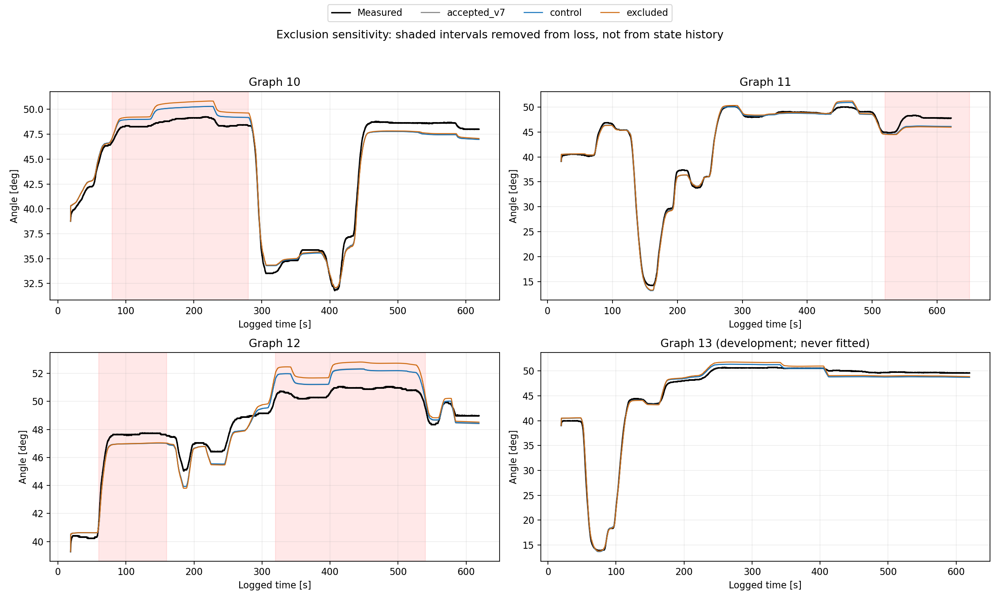

# 제외 피팅 결과: 데이터 불량으로 단정할 근거 없음

2026-10-10 정리. 승인 모델 V7는 유지한다. 이 실험으로 원본 데이터를 삭제하거나
제외 모델을 채택하지 않았다. 실기 명령도 실행하지 않았다.

현재 모델 변경점은 [MODEL_V7.md](../../../ph_model/MODEL_V7.md)에 정리했다.
승인 V7 모델·CSV·PNG/PDF는 `0ecec11`로 원격에 보존했다.

## 결론

**주요 잔차 구간을 빼도 나머지가 뚜렷하게 좋아지지 않았고, 개발 성능은 악화됐다.**
따라서 “그 구간만 잘못 측정돼 전체 피팅을 망친다”는 가설을 이번 결과가 지지하지 않는다.
데이터가 정확하다는 증명도 아니다. 일부 프로파일 개선과 다른 프로파일 악화가 함께
나타나므로, 현재 모델의 조건별 표현력/파라미터 절충도 계속 고려해야 한다.

## 동일 표본에서 비교한 RMSE

| 평가 부분 | 표본 수 | 승인 V7 | 전체 데이터 재피팅(Control) | 구간 제외 피팅(Excluded) |
| --- | ---: | ---: | ---: | ---: |
| 학습 자료 중 남긴 부분 | 29,878 | 0.6410° | 0.6348° | 0.6340° |
| 학습 자료 중 제외 대상 | 6,216 | 1.1445° | 1.1397° | 1.4859° |
| 전체 학습 자료 | 36,094 | 0.7522° | 0.7465° | 0.8444° |
| 개발 seed 3 | 6,005 | 0.7144° | 0.7080° | 0.7526° |
| 과거 진단 seed 4 앞부분 | 3,375 | 0.4019° | 0.3999° | 0.4180° |

제외 효과는 **Control과 Excluded**를 비교해야 한다. 승인 V7 대비 남긴 부분의
개선 대부분은 추가 재피팅만으로도 얻어진다. 실제 제외에 따른 추가 개선은 약
0.00083°(0.13%)뿐이다. 반면 제외 대상의 오차는 약 30%, 개발 오차는 약 6% 커졌다.
기존 V7로 초기화한 민감도 실험이며 블라인드 검증이 아니다. 개발 자료는 과거 V7
선택에 사용됐고, seed 4도 과거에 확인한 자료다. 새로운 독립 시험이라고 주장하지 않는다.

제외한 곳은 10번 80–280초, 11번 520초 이후 유효 구간, 12번 60–160초와
320–540초다. 총 학습 표본의 약 17.2%다. [사전 프로토콜](PROTOCOL.md)에 범위를
고정했고 결과를 보고 다시 바꾸지 않았다. 나머지 잔차를 모두 없앤 실험은 아니다.
13번 후반은 원래 개발 데이터여서 학습에 포함하지 않았다.

## 그래프 확인



검정: 실측, 회색: 승인 V7, 파랑: Control, 주황: Excluded.
붉은 음영은 손실에서 제외한 구간이며 압력 입력이나 이력 상태를 끊은 구간이 아니다.

- **10번:** 제외한 고각도 유지 구간의 과대 추정이 더 커졌다. 후반의 낮은 예측도 해결되지 않았다.
- **11번:** 마지막 실제 상승을 충분히 따라가지 못하는 현상이 그대로 남았다.
- **12번:** 초기 유지점의 과소 추정은 그대로이고, 중간 고각도 과대 추정은 더 커졌다.
- **13번:** 개발 구간의 중간 과대 추정/후반 과소 추정이 해결되지 않았다.
- **5번 S1a:** 일부 상승 편차와 약 150초 하강 편차는 개선됐다. 그러나 전체 자료의 개선은 아니다.

| 프로파일 | Control | Excluded |
| --- | ---: | ---: |
| 5 / S1a | 1.257° | 1.085° |
| 6 / S1b | 0.668° | 0.639° |
| 9 / S4 | 0.446° | 0.519° |
| 10 / S6 seed 0 | 0.859° | 1.024° |
| 11 / S6 seed 1 | 0.775° | 0.844° |
| 12 / S6 seed 2 | 0.880° | 1.158° |

최적화 손실은 단순 전체 표본 RMSE가 아니라 실행/각도 구간별 가중치와 운동 변화량,
물리 정규화 항을 포함한다. 그래서 일부 실행 개선으로 손실은 줄어도 전체 RMSE가
같이 줄지는 않는다. 제외 후 남긴 항의 가중치는 그대로 두므로 데이터 항 대비
정규화의 상대적 영향이 달라지는 효과도 포함된 탐색적 비교다.

## 장시간 오차도 해결되지 않았다

개발 데이터의 각도 변화량 RMSE:

| 저변동 창 | 승인 V7 | Control | Excluded |
| --- | ---: | ---: | ---: |
| 30초 / 34개 창 | 0.258° | 0.253° | 0.263° |
| 120초 / 19개 창 | 0.996° | 0.983° | 1.062° |

실측 각도 범위로 고른 겹치는 창이므로 독립 표본이나 순수 일정압 크리프 시험은 아니다.
상세 값은 [long_motion.csv](long_motion.csv)에 보존했다.
느린 이력 시정수 파라미터는 Control 600초에서 Excluded 약 236초로 바뀌었다.
압력/속도 배율이 붙는 기저 시정수이므로 실제 크리프 시간 상수를 직접 측정한 값은
아니다. 제외 구간이 이력 파라미터 제약에 영향을 준다는 민감도는 보이지만,
그것만으로 해당 측정이 잘못됐다고 판정할 수 없다.

## 원본 데이터는 무엇이 의심되는가

[원본 로그 점검](DATA_QUALITY.md)에서 조사 구간의 각도/압력 결측은 0개,
sensor_valid는 모두 1, 메시지 나이는 최대 약 15 ms였다. 동일 각도 값 최장 기록은
약 0.06초이며 세 실행 모두 정상 종료와 같은 엔코더 보정이 기록됐다.
긴 통신 끊김이나 각도 값 고정으로 이 부분만 잘못 기록됐다는 증거는 발견하지 못했다.

단, ROS 메시지 갱신은 센서 참값 검증이 아니다. 보정 오차, 미끄러짐, 접촉,
온도/장력/초기 이력 차이는 여전히 분리되지 않는다.
**원본은 유지하고, 재수집한다면 해당 S6 seed 0·1·2를 같은 기존 프로파일/해시로
반복 측정해 재현성을 확인하는 것이 우선이다.** 전체 자료를 폐기할 근거는 없다.
독립 각도 관찰을 함께 남기고 시작 상태/장착/워밍업/직전 이력을 맞추는 것이 중요하다.
안전 규칙이나 압력 제어 설정은 변경하지 않는다.

## 검증과 보존

- Control: nfev 12, Excluded: nfev 25. 동일 최대 25회, 같은 종료 기준에서 둘 다 ftol 종료.
  최적성 지표는 각각 0.00651 / 0.00500. 전역 최적해를 보장하지 않는다.
- 기존 수치 해법의 조기 종료 시도는 `initial_solver_attempt/`에 따로 보존했다.
  주 결과는 5 ms, safeguarded Newton/이분법을 사용한다. 승인 V7 기본 계산 경로는 유지했다.
- 독립 LSODA 대비 각도 차이 RMSE: Control 0.00745°, Excluded 0.00828°.
  최대 순간 차이는 각각 0.03955° / 0.04237°. RMSE 허용치 0.03° 이내다.
- 두 모델 각각 5,000개 상태에서 수동성 부등식 위반 0, 무입력 에너지 증가 없음.
  자유 힘/압력 의존 저장 에너지/음의 소산 항을 추가하지 않았다.
- CSV 45,474행에서 기존 열은 그대로 보존하고 마스크 및 두 후보 예측 열만 추가했다.
  원래 유효 블록 시작 외에는 실측 각도 주입이나 상태 초기화를 하지 않았다.
- 원본 로그, 논문, 승인 V7 모델/CSV는 변경하지 않았다. SHA256은 `provenance.json`에 있다.
- 테스트 117개 통과. 실제 하드웨어 검증은 하지 않았다.

## 파일과 재현

[전체 비교 PDF](comparison.pdf) · [CSV](all_runs.csv) · [요약 지표](summary.csv)
· [실행별 지표](run_metrics.csv) · [원본 품질 통계](raw_quality.csv)

```bash
export PYTHONNOUSERSITE=1 PYTHONPATH=.residual_deps MPLCONFIGDIR=/tmp/ph_mpl
export OPENBLAS_NUM_THREADS=1 OMP_NUM_THREADS=1
python3 -m ph_model.exclusion_study control --nfev 25
python3 -m ph_model.exclusion_study excluded --nfev 25 --workers 4
python3 -m ph_model.exclusion_study evaluate
python3 -m pytest -q tests
```

기존 로컬 모델링 입력 산출물과 원본 품질 점검용 로그가 필요하다.
산출물의 `excluded_model.json`은 비교용이며 승인된 V7 모델의 대체본이 아니다.
